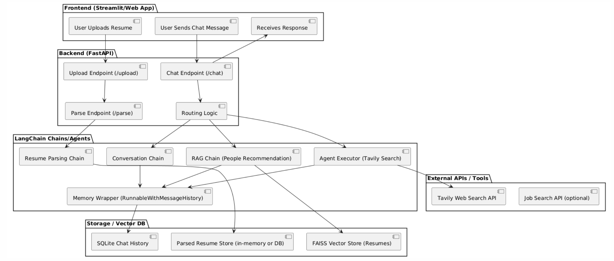

# 🤖 My-Resume-Helper (an LLM-Powered Resume Assistant)



This project is an interactive chatbot that analyzes user resumes, answers questions, provides career suggestions, and recommends similar individuals using Retrieval-Augmented Generation (RAG), external tools like Tavily Search, and agent-based decision routing.

Built with:
- 🧠 LangChain (Chains, Agents, RAG)
- 🚀 FastAPI (backend API)
- 💬 Streamlit (optional frontend)
- 🔍 FAISS (resume similarity search)
- 🌐 Tavily API (real-time web search)


## 🗂 Features

- ✅ Upload and parse PDF resumes using LLM
- ✅ Chat with memory about resume content
- ✅ Recommend similar people using FAISS + resume summaries
- ✅ Perform real-time searches via Tavily (agent tool)
- ✅ Modular chain and agent routing logic
- ✅ Session-based chat history stored in SQLite


## 🔧 Project Structure

```bash
backend/
├── main.py                # FastAPI entrypoint
├── chains.py              # LangChain chains (chat, RAG, etc.)
├── agent_tools.py         # Tools used by the agent (e.g. Tavily)
├── router.py              # Chain/agent routing logic
├── helper.py              # Chat memory, file decoding, database actions
├── faiss_people.py        # FAISS vectorstore builder & loader
├── database.py            # Chat history DB builder
chat_history.db            # SQLite chat history storage (created upon code execution)
resume_data.db             # SQLite resume raw + parsed storage (created upon code execution)
app.py                     # Streamlit frontend
```

## 🛠️ Prerequisites

Before running this project, please make sure you have the following installed:

- 🐳 [Docker](https://docs.docker.com/get-docker/) – for running the backend and frontend in a container
- 🐍 [Miniconda or Anaconda](https://docs.conda.io/en/latest/miniconda.html) – for managing Python environments (optional but recommended)
- 🤖 [Ollama](https://ollama.com/download) – for running local LLMs like LLaMA 3
- 🔧 [Git](https://git-scm.com/downloads) – to clone this repository


## 🚀 Getting Started

1. **Clone the repo**
```bash
git clone https://github.com/daidouya/my-resume-helper.git
cd my-resume-helper
```
2. **Set up environment with Conda**
```bash
conda create -n my-resume-helper python=3.12
conda activate my-resume-helper
pip install -r requirements.txt

# (optional for python notebook)
pip install ipykernel
python -m ipykernel install --user --name=my-resume-helper --display-name "my-resume-helper"
```
3. **Add Tavily API Key**
```bash
cp .env.example .env
```
Then fill in Tavily api key:
```env
TAVILY_API_KEY= <YOUR API KEY>
```
> **Note:** modify other fields as needed

4. **Launch backend and frontend**
```bash
# manually
uvicorn backend.main:app --host 0.0.0.0 --port 8000                 # start backend
streamlit run app.py --server.port 8501 --server.address 0.0.0.0    # start frontend

# (or with Docker)
docker build -t my-resume-helper .
docker run -p 8501:8501 -p 8000:8000 my-resume-helper
```